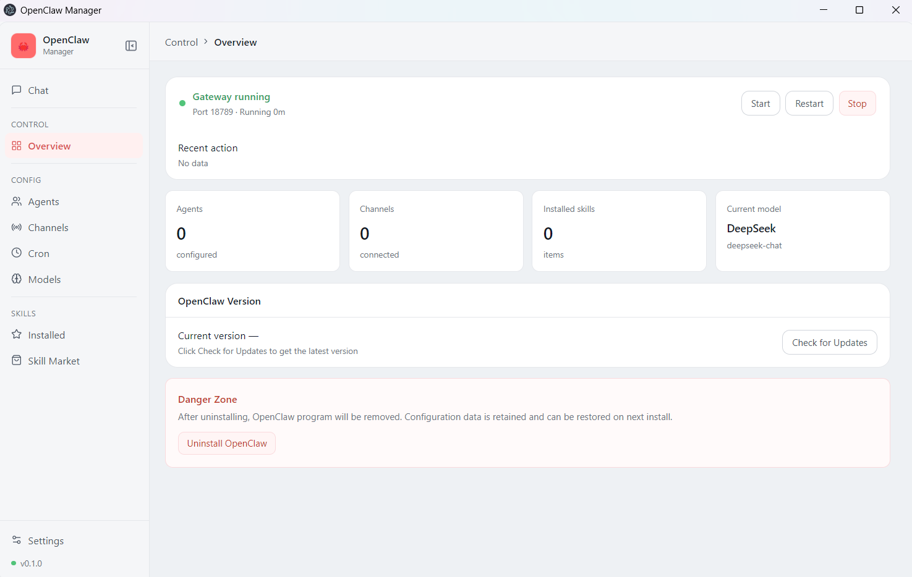
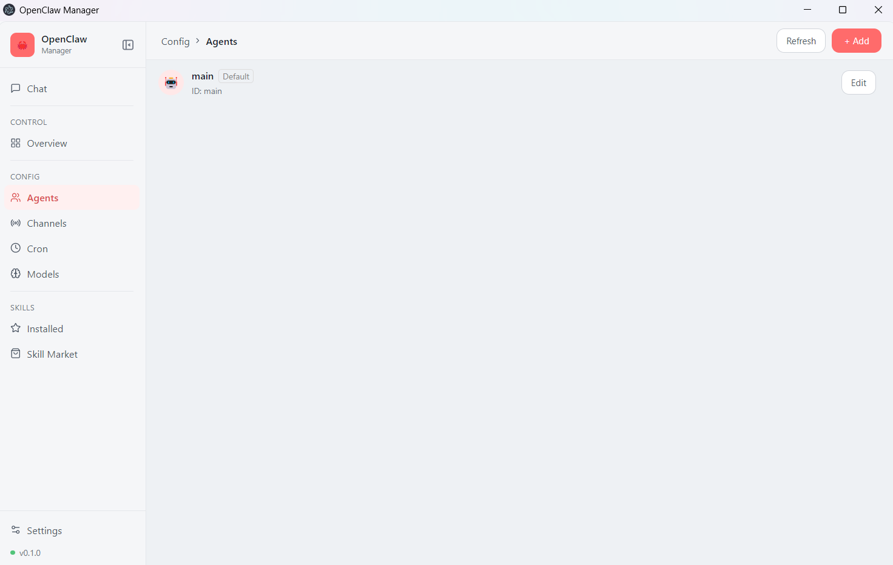
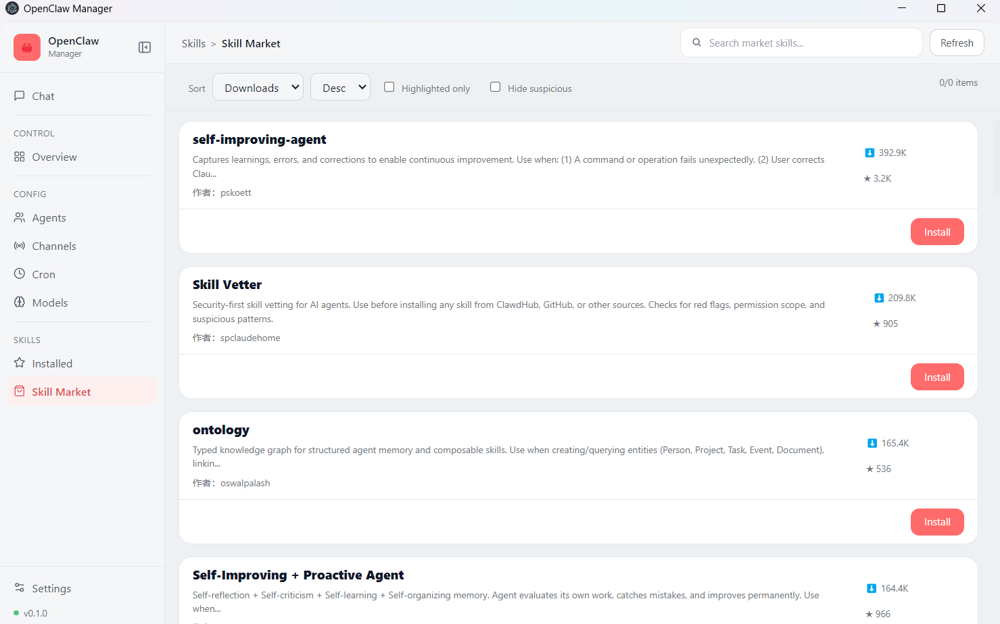

English | [中文](./README_zh.md)

[](./LICENSE)

# OpenClaw Manager

The project is organized using a two-tier Electron structure:

- `main.js` + `preload.js`: Electron main process and IPC

- `renderer/`: React + TypeScript + Zustand + Tailwind (shadcn style components)

## Screenshot

<p align="center">
  
</p>
<p align="center">
  
</p>
<p align="center">
  
</p>

## Running

1) Install dependencies

```bash
pnpm install
pnpm run renderer:install

```
2) Start the rendering layer (Vite)

```bash
pnpm run renderer:dev

```
3) Start Electron (load React Dev Server)

```bash
pnpm run dev:electron-react

```