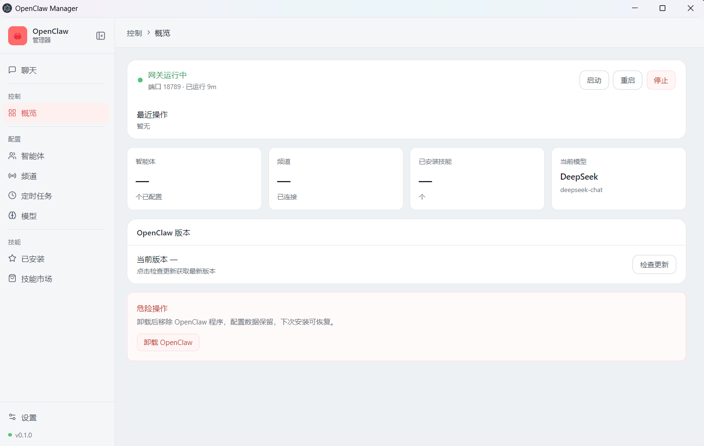
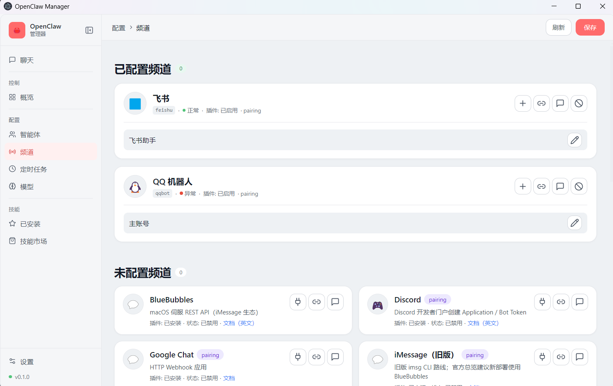
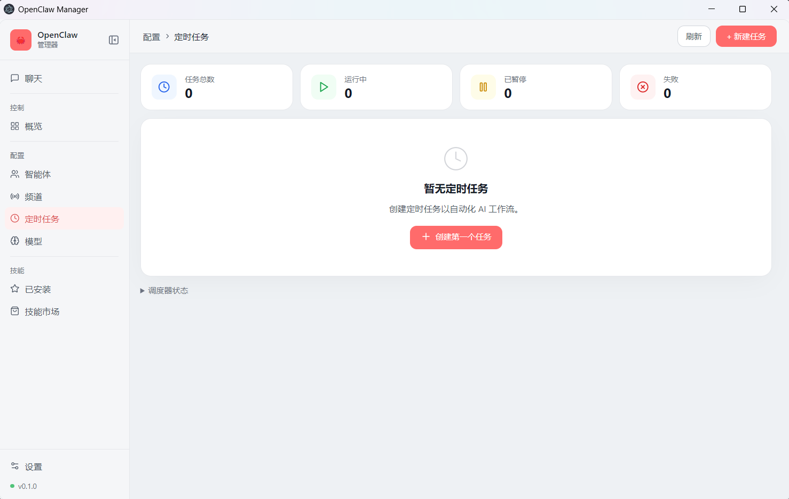
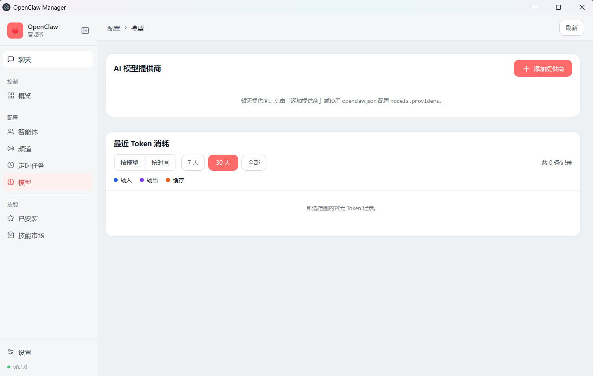
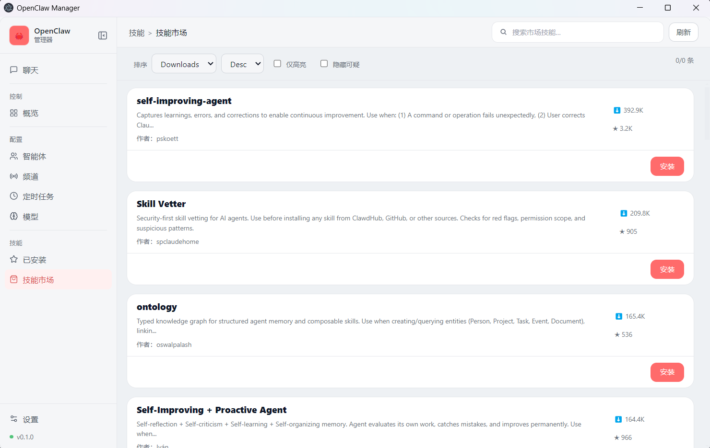

[English](./README.md) | 中文

[](./LICENSE)

# OpenClaw Manager

### 基于 Electron 与 React 构建的 OpenClaw 桌面管理工具，通过可视化界面简化网关控制、智能体管理与交互聊天操作，以直观 UI 替代复杂命令行指令，实现 OpenClaw 全流程高效管控。

项目按 Electron 双层结构组织：

- `main.js` + `preload.js`：Electron 主进程与 IPC
- `renderer/`：React + TypeScript + Zustand + Tailwind（shadcn 风格组件）

## 截图预览

<p align="center">
  
</p>
<p align="center">
  
</p>
<p align="center">
  
</p>
<p align="center">
  
</p>
<p align="center">
  
</p>

## 运行

1) 安装依赖

```bash
pnpm install
pnpm run renderer:install
```

2) 启动渲染层（Vite）

```bash
pnpm run renderer:dev
```

3) 启动 Electron（加载 React Dev Server）

```bash
pnpm run dev:electron-react
```

